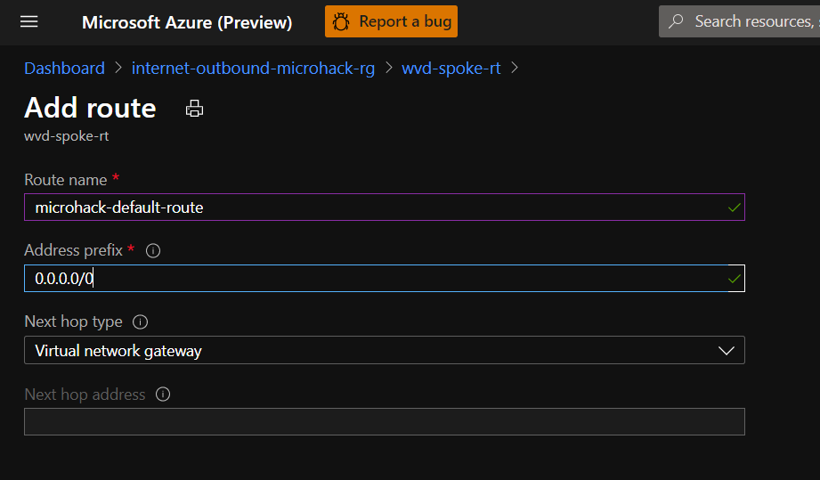
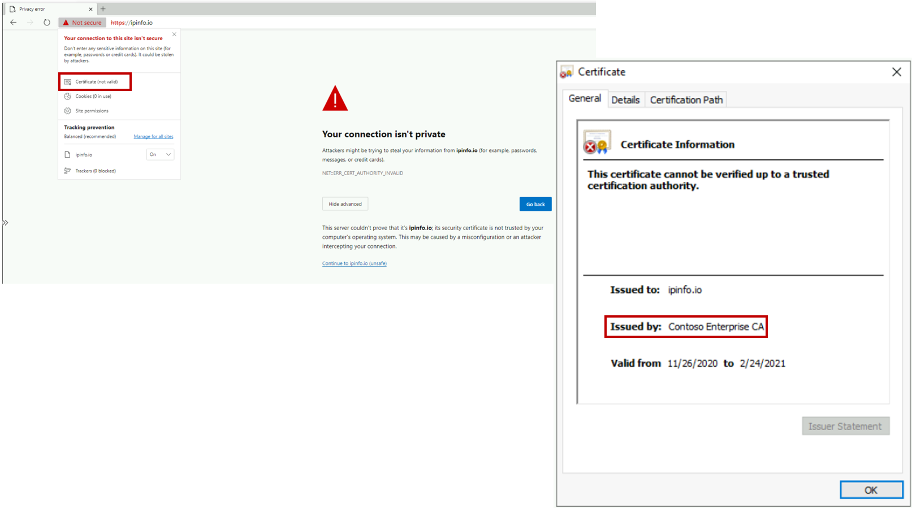
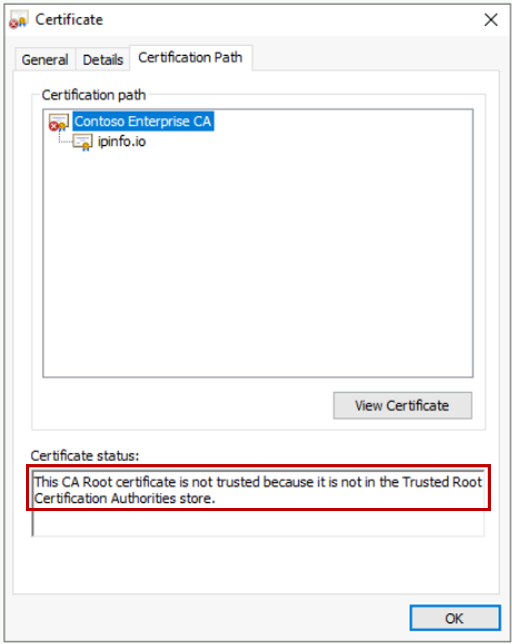
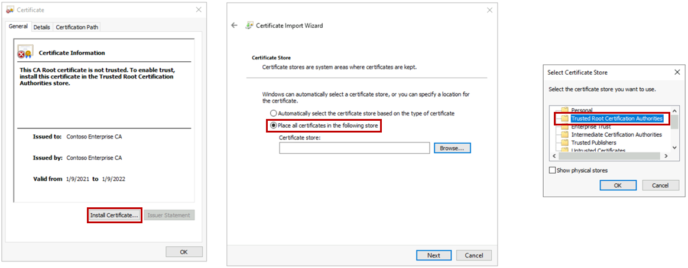

# Internet outbound connectivity MicroHack

### [Scenario](#scenario)
### [Prerequistes](#prerequisites)

### [Challenge 1: Forced tunneling](#challenge-1-forced-tunneling-1)

### [Challenge 2: Route internet traffic through Azure Firewall](#challenge-2-route-internet-traffic-through-azure-firewall-1)

### [Challenge 3: Add a proxy solution](#challenge-3-add-a-proxy-solution-1)

# Scenario
Contoso Inc., a financial services company, has recently started a datacenter migration project aimed at moving several LOB applications and a VDI farm to Azure. In its corporate network, Contoso enforces a strict security policy for internet access. The security team requested that the same policy be applied in the cloud. To address this requirement, the network team configured Azure VNets to route back to the on-prem datacenter all internet-bound connections (aka "[forced tunneling](https://docs.microsoft.com/en-us/azure/vpn-gateway/vpn-gateway-forced-tunneling-rm)").  Both the security team and Contoso's CTO endorsed the solution. Forced tunneling allows managing internet traffic in the cloud in the very same way as in the corporate network. Also, it leverages the significant investments made by Contoso over the last few years in on-premises network security equipment, such as firewalls, proxies, IDS/IPS.

Forced tunneling allowed Contoso to migrate the first, simple IaaS workloads (lift&shift). But its limitations became clear as soon as Contoso deployed more advanced Azure services:

- Users reported poor performance when using Windows Virtual Desktop, which was identified as the most cost-effective solution to move VDI workloads to Azure;
- WVD users generated a high volume of traffic related to internet browsing, which drove hybrid connectivity costs up;
- Many VNet-injected PaaS services (such as [Databricks](https://docs.microsoft.com/en-us/azure/databricks/administration-guide/cloud-configurations/azure/on-prem-network) and [HDInsight](https://docs.microsoft.com/en-us/azure/hdinsight/control-network-traffic#forced-tunneling-to-on-premises) that Contoso' s data scientists plan to deploy) have internet access requirements that are difficult to address with forced tunneling.  

This Microhack walks through the implementation of a secure internet edge in the cloud, based on Azure Firewall, that overcomes the limitations of forced tunneling and enables Contoso to deploy the advanced PaaS services required by the business, while complying with corporate security policies.
# Prerequisites
## Overview

In order to use the MicroHack time most effectively, the following tasks should be completed prior to starting the session.
At the end of this section your base lab build looks as follows:

In summary:

- Contoso's on-prem datacenter is  simulated by an Azure Virtual Network ("onprem-vnet"). It contains a Linux VM that (1) terminates a site-2-site VPN connection to Contoso's Azure network and (2) simulates Contoso's on-prem secure internet edge (proxy based on Squid). Please note that  Linux system administration skills and knowledge of IPTables/Squid are *not* required to complete this MicroHack. 
- Contoso's Azure virtual datacenter is a hub&spoke network. The hub VNet ("hub-vnet") contains a Virtual Network Gateway that terminates the site-2-site VPN connection to Contoso's on-prem datacenter. The spoke VNet ("wvd-spoke-vnet") contains a Win10 workstation that  *simulate*s a WVD workstation (it is a standalone VM, not a WVD session host, to reduce complexity. But all the network-related configurations that will be discussed apply with no changes to a real WVD session host).
- Azure Bastion is deployed in the "onprem-vnet"  and in the "wvd-spoke-vnet "to enable easy remote desktop access to virtual machines.
- All of the above is deployed within a single resource group called *internet-outbound-microhack-rg*.

## Task 1 : Deploy Templates

We are going to use a predefined Terraform template to deploy the base environment. It will be deployed in to *your* Azure subscription, with resources running in the specified Azure region.

To start the Terraform deployment, follow the steps listed below:

- Login to Azure cloud shell [https://shell.azure.com/](https://shell.azure.com/)
- Ensure that you are operating within the correct subscription via:

`az account show`

- Clone the following GitHub repository 

`git clone https://github.com/fguerri/internet-outbound-microhack`

- Go to the new folder "internet-outbound-microhack/templates" and initialize the terraform modules and download the azurerm resource provider

`cd internet-outbound-microhack/templates`

`terraform init`

- Now run apply to start the deployment 

`terraform apply`

- Choose a suitable password to be used for your Virtual Machines administrator account (username: adminuser)
- Choose you region for deployment (location). E.g. eastus, westeurope, etc
- When prompted, confirm with a **yes** to start the deployment
- Wait for the deployment to complete. This will take around 30 minutes (the VPN gateway takes a while).

## Task 2 : Explore and verify the deployed resources

- Verify you can access via Azure Bastion both the Win10 VM in the "wvd-spoke-vnet" and the on-prem Linux box (Username: "adminuser"; Password: as per the above step).

- Verify that your VNet Peering and Site-to-site VPN are functioning as expected: From the "wvd-workstation" VM, access the on-prem Linux box via SSH (IP address: 10.57.2.4).

## :checkered_flag: Results

- You have deployed a basic Azure and On-Premises environment using a Terraform template
- You have become familiar with the components you have deployed in your subscription
- You are now be able to login to all VMs using your specified credentials
- End-to-end network connectivity has been verified from On-Premises to Azure

Now that we have the base lab deployed, we can progress to the MicroHack challenges!
# Challenge 1: Forced tunneling

In this challenge, you will configure forced tunneling in Contoso's Azure VNets, as initially suggested by the network team.  

## Task 1: Configure default route in wvd-spoke
Your Microhack environment has been deployed with a default routing configuration whereby Azure VMs have direct access to the internet. Log onto the wvd-workstation, open Microsoft Edge and verify that you can browse the internet without restrictions. Before modifying the existing configuration, point your browser to https://ipinfo.io and take note of the public IP address it returns. Confirm that it is the public IP address assigned to your VM. In the Azure portal, search "wvd-workstation" and find the public IP address in the "Overview" section:

In the Azure portal, find the Route Table "wvd-spoke-rt" associated to the wvd-workstation's subnet and add a default route to send all internet-bound traffic to on-prem, via the site-2-site IPSec tunnel:

In Azure Cloud Shell, configure the VPN Gateway with a default route to send all internet-bound traffic to on-prem:

`$lgw = Get-AzLocalNetworkGateway -Name onprem-lng -ResourceGroupName internet-outbound-microhack-rg`

`$gw = Get-AzVirtualNetworkGateway -Name hub-vpngw -ResourceGroupName internet-outbound-microhack-rg`

`Set-AzVirtualNetworkGatewayDefaultSite -VirtualNetworkGateway $gw -GatewayDefaultSite $lgw`

> Please note that setting the VPN gateway default site is only required for statically routed tunnels (i.e. when BGP is not used). Similarly, no default site setting is needed when using Expressroute instead of site-to-site VPN. More details are available [here](https://docs.microsoft.com/en-us/azure/vpn-gateway/vpn-gateway-forced-tunneling-rm#configure-forced-tunneling-1).

Verify that internet access from the wvd-workstation is now controlled by Contoso's on-prem proxy. Browse again to https://ipinfo.io. The error message that you see is due to the TLS inspection performed by the proxy. 

In order to access the internet via Contoso's on-prem proxy, you must configure the wvd-workstation to trust the cerficates issued by the proxy, which we will do in the next task.

## Task 2: Access the internet via on-prem proxy

The on-prem proxy performs TLS inspection by terminating on itself the TLS connection initiated by your browser and setting up a new one between itself and the server. As the proxy does not have access to the server's private key, it dynamically generates a new certificate for the server's FQDN. The certificate is signed by Contoso's enterprise CA, which your browser does not currently trust.

As a Contoso employee, you are willing to trust Contoso's Enterprise CA, which you can do by installing it in your certificate store. 

- Select the "Contoso Enterprise CA" certificate as shown in the previous figure
- Click on "View certificate"
- Click on "Details"
- Click on "Copy to file...", accept all defaults suggested by the wizard and save the certificate on your desktop

- Double-click on the certificate file on your desktop and use the wizard to install it in the "Trusted Root Certification Authorities" store

> You may wonder if installing the proxy's self-signed certificate is a security best practice. While in general you should never install  certificates from unknown third parties in the "Trusted Root Certification Authorities" store, in this scenario you are installing on a Contoso workstation a certificate generated by Contoso's own certification authority. Many organizations use root certificate authorities to generate certificates that are meant to be trusted only internally. 

> In real-world scenarios, certificates can be automatically distributed to workstations using configuration management tools (for example, certificates can be distribute to domain-joined computers by means of Windows Server AD GPOs). 

- In Microsoft Edge, click the reload button and verify that you can now access https://ipinfo.io
- Verify that the public IP you're using to access the internet is now the proxy's public IP

Now that your browser trusts the certificates generated by the proxy, you can browse the internet, subject to Contoso's security policy. 

- Browse to https://docs.microsoft.com and confirm that you can access the site
- Confirm that you can access O365 applications. For example, browse to https://outlook.office365.com and access your mailbox (if you have one)
- Browse to any other sites such as https://ebay.com or https://www.wired.com and confirm that your connections are blocked by the proxy 

## :checkered_flag: Results

You have now a forced tunnel configuration in place. 

- All connections initiated by the wvd-workstation are routed to Contoso's on-prem datacenter
- HTTP/S connections are transparently intercepted by the proxy and allowed/denied based on the configured security policy. The proxy bumps TLS connections, which allows further inspection (IDS/IPS, anti-virus, etc)
- Any other connection initiated by the wvd-workstation is routed to Contoso's on-prem firewall and dropped 

# Challenge 2: Route internet traffic through Azure Firewall

In this challenge you will explore how Contoso can address the performance problem reported by WVD users. You will build a secure edge in Azure, thus removing the need to route all internet-bound connections to Contoso's on-prem datacenter (red line). Routing WVD traffic directly to the internet via Azure Firewall reduces latency and improves user experience (green line).

## Task 1: Deploy Azure Firewall

In the Azure Portal, deploy a new Azure Firewall instance in the hub-vnet. A subnet named "AzureFirewallSubnet" has been already created for you. 

When the deployment completes, go to the new firewall's overview tile a take note of its *private* IP address. This IP address will become the default gateway for Contoso's Azure VNets. 

## Task 2: Configure a default route via azure Firewall

In the Azure portal, go to the Route Table "wvd-spoke-rt" and modify the next hop of the default route that you defined in the previous challenge. Replace the next hop "Virtual Network Gateway" with the private IP of your Azure firewall instance.

Remove the default route configuration from the VPN gateway (configured in Challenge 1):

`$gw= Get-AzVirtualNetworkGateway -Name hub-vpngw -ResourceGroupName internet-outbound-microhack-rg`

`Remove-AzVirtualNetworkGatewayDefaultSite -VirtualNetworkGateway $gw`

Verify that you no longer have connectivity to the internet from the wvd-workstation. Connections are now being routed to Azure Firewall, which is running with the default "deny all" policy.

## Task 3: Implement Contoso's security policy with Azure Firewall rules

Configure Azure Firewall to implement the same internet access policy as Contoso's on-premises proxy:

- Access to "docs.microsoft.com" is allowed
- Access to "ipinfo.io" is allowed
- Access to any other sites is denied

In the Azure Portal, create a new application rule collection for Azure Firewall as shown in the screenshot below.

Confirm that you can now access https://ipinfo.io and https://docs.microsoft.com. Verify that your public IP address is now the public IP address of your Azure Firewall.

## Task 4: Enable access to WVD endpoints via Azure Firewall

In this task you will address the performance issues reported by Contoso's WVD users, by allowing direct access to WVD endpoints via Azure Firewall. 

WVD session hosts connect to a list of well-known endpoints, documented [here](https://docs.microsoft.com/en-us/azure/virtual-desktop/safe-url-list#virtual-machines). Each WVD endpoint has an associated Azure Service Tag. 

Azure Firewall supports service tags, which would make it easy to configure rules to allow access to WVD required URLs.  However, Azure Firewall rules allowing connections to "Azure Cloud" and "Internet" are not compatible with Contoso's security requirements. 

You have negotiated with the security team a solution that strikes an acceptable trade-off between security and WVD performance:

- Only the "Windows Virtual Desktop" service tag, which corresponds to a small set of Microsoft-controlled endpoints, will be used in the firewall configuration
- For the other required URLs, application rules matching only the specific URLs will be used.

To implement this policy, go to the "scripts/" directory and execute the wvd-firewall-rules.ps1 script. 

  ` cd`

  `cd internet-outbound/scripts`

  `./wvd-firewall-rules.ps1 -AzFwName <your Azure Firewall name>`
  
When done, go to your Azure Firewall configuration in the portal and verify that you have two rule colletions (one network rule collection, one application rule collection) that allow access to the endpoints listed in the previous figure.

## :checkered_flag: Results

When the new rules are applied, verify that you can access any site in the microsoft.com domain from the wvd-workstation. Browse to https://ipinfo.io and verify that your public IP address has changed again. In the Azure portal, confirm that your address corresponds to your Azure Firewall instance's public IP.  

# Challenge 3: Add a proxy solution

Contoso's security team recognized that the solution implemented in the previous challenge works well for server-generated traffic, such as connections between WVD session hosts and WVD endpoints. Azure Firewall, with its IP- and FQDN-based filtering capabilities,  provides a cost effective solution to secure access to known/trusted endpoints. However, with WVD being rolled out, Contoso raised concerns about its applicability to traffic generated by users browsing the internet from their WVD workstations:    

- Users tend to access broad sets of URLs, which are best specified by category (news, e-commerce, gambling, ...) instead of black/whitelists of known FQDNs
- The security team insists on applying TLS inspection at least to connections to low-trust domains, as Contoso's on-prem proxy currently does
- The security team considers the existing on-prem proxy a fundamental security control, because of its logging, inspection and authentication capabilities. At the same time, they have no budget to deploy a functionally equivalent proxy solution in Azure.
- The security team is also reluctant to approve direct access via Azure Firewall to the [broad set of URLs required by Office365](https://docs.microsoft.com/en-us/microsoft-365/enterprise/urls-and-ip-address-ranges?view=o365-worldwide). The topic is highly controversial because routing O365 traffic back to on-prem would drive cost for ER and/or VPN connectivity up

The following solution has been identified as the optimal trade-off between the conflicting requirements listed above:

- Server VMs will access the internet directly via Azure Firewall (i.e. the configuration you created in Challenge 2)
- WVD workstations will use a  selective proxying policy whereby trusted destinations (such as Azure PaaS service and a subset of O365 URLs) will be reached directly via Azure Firewall, while general internet traffic is sent to Contoso's on-premises security appliances.

The following tasks will walk through the configuration of WVD workstations.

## Task 1: Configure an explicit proxy on wvd-workstation

As the wvd-workstation runs in a subnet whose default gateway is now Azure Firewall (Challenge 2), you cannot rely on transparent proxy interception as you did in Challenge 1. An explicit proxy configuration is now required. Moreover, you need to specify which destinations should be reached directly via Azure Firewall and which ones should be reached via Contoso's on-prem proxy. You can do so by means of a "Proxy Automatic Configuration (PAC)" file. In the Microhack environment, some PAC files are available at  http://10.57.2.4:8080. To configure Microsoft Edge to use a PAC:

- verify that a PAC file is available by browsing to http://10.57.2.4:8080/proxypac-3-1.pac. Note that, on line 7, the script allows direct to "ipinfo.io"
- go to "Settings" ==> "System" ==> "Open System Proxy Settings"
- enter "http://10.57.2.4:8080/proxypac-3-1.pac" as the script address
- click "Save"

- Open a new tab and browse to https://ipinfo.io to see the public IP address you're using to access the internet. Verify that it is  your Azure Firewall's public IP. This confirms that you are reaching https://ipinfo.io directly .
- Open a new tab and browse to https://whatismyipaddress.com . Verify that it is the public IP assigned to the onprem-proxy-vm. This confirms that you are reaching https://whatismyipaddress.com via Contoso's on-prem proxy.

## Task 2: Optimize O365 connectivity

The selective proxying configuration defined in the previous task can be used to optimize access to Office365, according to the connectivity principles documented [here](https://docs.microsoft.com/en-us/microsoft-365/enterprise/microsoft-365-network-connectivity-principles?view=o365-worldwide#new-office-365-endpoint-categories). In a nutshell, the endpoints and URLs that must be reachable from a workstation to successfully consume O365 applications are divided into three categories:

- **Optimize** endpoints are required for connectivity to  every Office 365 service and represent over 75% of Office 365 bandwidth, connections, and volume of data. These endpoints represent Office 365  scenarios that are the most sensitive to network performance, latency,  and availability. All endpoints are hosted in Microsoft datacenters. The rate of change to the endpoints in this category is expected to be much lower than for the endpoints in the other two categories.
- **Allow** endpoints are required for connectivity to  specific Office 365 services and features, but are not as sensitive to  network performance and latency as those in the *Optimize*  category. The overall network footprint of these endpoints from the  standpoint of bandwidth and connection count is also smaller. These  endpoints are dedicated to Office 365 and are hosted in Microsoft  datacenters.
- **Default** endpoints represent Office 365 services and  dependencies that do not require any optimization, and can be treated by customer networks as normal Internet bound traffic. Some endpoints in  this category may not be hosted in Microsoft datacenters.

As the "Optimize" and "Allow" endpoints are hosted in Microsoft datacenters, Contoso's security team has accepted to allow direct access to them via Azure Firewall. They requested that the on-prem proxy is used only for traffic to the "Default" endpoints. 

To implement this policy, you are going to need:

- a PAC file to bypass the proxy for connections to "Optimize" and "Allow" endpoints
- Azure Firewall rules to allow connections to "Optimize" and "Allow" endpoint

Contoso's on-prem proxy already allows access to "Default" endpoints because it is currently used to consume those endpoints from the corporate network. 

An [Office 365 IP Address and URL web service](https://docs.microsoft.com/en-us/microsoft-365/enterprise/microsoft-365-ip-web-service?view=o365-worldwide) allows downloading an up-to-date list of all endpoints (URLs, IP addresses, category, ect). Therefore, both the proxy PAC file and the firewall rules can be automatically generated (and refreshed on a regular basis). In the MicroHack environment, the PAC file has been already generated and can be downloaded from http://10.57.2.4:8080/O365-optimize.pac. In order to use it, update the PAC settings in Microsoft Edge:

Now try and access your O365 mailbox at https://outlook.office365.com. You will get an access denied message. This is expected: The PAC file causes some connections to go directly to Azure Firewall, which is not yet configured with the proper rules.

The Azure Firewall rules can be generated automatically, by consuming the endpints web service. A Powershell script is provided to do so:
- go to the "internet-outboud-microhack/scripts/" directory

  ` cd`

  `cd internet-outbound/scripts`

- run the Powershell script "o365-firewall-rules.ps1"

  `./o365-firewall-rules.ps1 -AzFwName <your Azure Firewall name>`

- When the script completes, go to the Azure portal and verify that network and application rule collections have been created for "Optimize" and "Allow" endpoints 

- Verify that you can successfully log into your O365 mailbox at https://outlook.office365.com.
## :checkered_flag: Results

You have built a network configuration that does not rely on forced tunneling and allows Contoso to leverage Azure Firewall to access Azure PaaS services and O365 applications with minimal latency. At the same time, you addressed the security team's requirement to use an existing on-prem proxy solution to secure generic internet access from WVD workstations.

# Finished? Delete your lab

- Delete the resource group internet-outbound-microhack-rg

Thank you for participating in this MicroHack!

  

