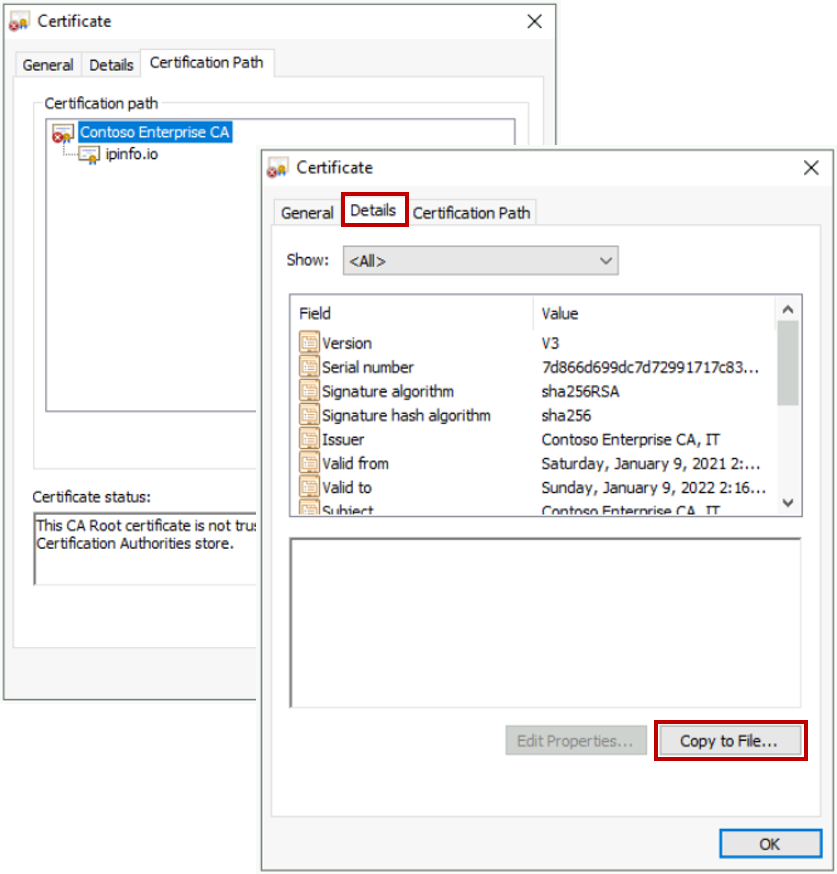

# Internet outbound connectivity MicroHack

# Scenario
Contoso Inc., a financial services company, has recently started a datacenter migration project aimed at moving several LOB applications and a VDI farm to Azure. In its corporate network, Contoso enforces a strict security policy for internet access, both for users and servers. The security team requested that the same policy be applied in the cloud. To address this requirement, the network team configured Azure VNets to route back to the on-prem datacenter all internet-bound connections i (aka "forced tunneling").  Both the security team and Contoso's CTO endorsed the solution. Forced tunneling allows managing internet traffic in Azure in the very same way as in the corporate network. Also, it leverages the significant investments made by Contoso over the last few years in on-premises network security equipment, such as firewalls, proxies, IDS/IPS. 

Forced tunneling allowed Contoso to migrate the first, simple IaaS workloads (lift&shift). But its limitations became clear as soon as Contoso deployed more advanced Azure services:

- Users reported poor performance when using Windows Virtual Desktop, which was identified as the most cost-effective solution to move VDI workloads to Azure;
- WVD users generated a high volume of traffic related to internet browsing, which drove cross-premises connectivity costs up;
- Many VNet-injected PaaS services (such as Databricks and HDInsight that Contoso' s data scientists plan to deploy) could not be deployed in VNets with a forced tunneling routing policy.  
## Objective
This Microhack walks through the implementation of a secure internet edge in the cloud, based on Azure Firewall, that overcomes the limitations of forced tunneling and enables Contoso to deploy the advanced PaaS services required by the business, while complying with corporate security policies.
# Prerequisites
## Overview

In order to use the MicroHack time most effectively, the following tasks should be completed prior to starting the session.
At the end of this section your base lab build looks as follows:

In summary:

- Contoso's on-prem datacenter is  simulated by an Azure Virtual Network ("onprem-vnet"). It contains a Linux VM that (1) terminates a site-2-site VPN connection to Contoso's Azure network and (2) simulates Contoso's on-prem secure internet edge (proxy based on Squid). Please note that  Linux system administration skills and knowledge of IPTables/Squid are *not* required to complete this MicroHack. 
- Contoso's Azure virtual datacenter is a hub&spoke network. The hub VNet ("hub-vnet") contains a Virtual Network Gateway that terminates the site-2-site VPN connection to Contoso's on-prem datacenter. The spoke VNet ("wvd-spoke-vnet") contains a Win10 workstation that  *simulate*s a WVD workstation (it is a standalone VM, not a WVD session host, to reduce complexity. But all the network-related configurations that will be discussed apply with no changes to a real WVD session host).
- Azure Bastion is deployed in the "onprem-vnet"  and in the "wvd-spoke-vnet "to enable easy remote desktop access to virtual machines.
- All of the above is deployed within a single resource group called *internet-outbound-microhack-rg*.

## Task 1 : Deploy Template

We are going to use a predefined Terraform template to deploy the base environment. It will be deployed in to *your* Azure subscription, with resources running in the specified Azure region.

To start the Terraform deployment, follow the steps listed below:

- Login to Azure cloud shell [https://shell.azure.com/](https://shell.azure.com/)
- Ensure that you are operating within the correct subscription via:

`az account show`

- Clone the following GitHub repository 

`git clone https://github.com/fguerri/internet-outbound-microhack`

- Go to the new folder "internet-outbound-microhack/templates" and initialize the terraform modules and download the azurerm resource provider

`cd internet-outbound-microhack/templates
terraform init`

- Now run apply to start the deployment 

`terraform apply`

- Choose a suitable password to be used for your Virtual Machines administrator account (username: adminuser)
- Choose you region for deployment (location). E.g. eastus, westeurope, etc
- When prompted, confirm with a **yes** to start the deployment
- Wait for the deployment to complete. This will take around 30 minutes (the VPN gateway takes a while).

## Task 2 : Explore and verify the deployed resources

- Verify you can access via Azure Bastion both the Win10 VM in the "wvd-spoke-vnet" and the on-prem Linux box (Username: "adminuser"; Password: as per the above step).

- Verify that your VNet Peering and Site-to-site VPN are functioning as expected: From the "wvd-workstation" VM, access the on-prem Linux box via SSH (IP address: 10.57.2.4).

## :checkered_flag: Results

- You have deployed a basic Azure and On-Premises environment using a Terraform template
- You have become familiar with the components you have deployed in your subscription
- You are now be able to login to all VMs using your specified credentials
- End-to-end network connectivity has been verified from On-Premises to Azure

Now that we have the base lab deployed, we can progress to the Private Link challenges!
# Challenge 1: Forced tunneling

In this challenge, you will configure forced tunneling in Contoso's Azure VNets, as initially suggested by the network team.  

## Task 1: Configure default route in wvd-spoke
Your Microhack environment has been deployed with a default routing configuration whereby Azure VMs have direct access to the internet. Log onto the wvd-workstation, open Microsoft Edge and verify that you can browse the internet without restrictions. Before modifying the existing configuration, point your browser to https://ipinfo.io and take note of the public IP address that your VM uses to access the internet.

In the Azure portal, find the Route Table "wvd-spoke-rt" associated to the wvd-workstation's subnet and add a default route to send all internet-bound traffic to on-prem, via the site-2-site IPSec tunnel:

In Azure Cloud Shell, configure the VPN Gateway with a default route to send all internet-bound traffic to on-prem:

`$lgw = Get-AzLocalNetworkGateway -Name onprem-lng -ResourceGroupName internet-outbound-microhack-rg`
`$gw = Get-AzVirtualNetworkGateway -Name hub-vpngw -ResourceGroupName internet-outbound-microhack-rg`
`Set-A zVirtualNetworkGatewayDefaultSite -VirtualNetworkGateway $gw -GatewayDefaultSite $lgw`

> Please note that setting the VPN gateway default site is only required for statically routed tunnels (i.e. when BGP is not used). Similarly, no default site setting is needed when using Expressroute instead of site-to-site VPN.

Verify that internet access from the wvd-workstation is now controlled by Contoso's on-prem proxy. Browse again to https://ipinfo.io. The error message that you see is due to the TLS inspection performed by the proxy. 

In order to access the internet via Contoso's on-prem proxy, you must configure the wvd-workstation to trust the cerficates issued by the proxy, which we will do in the next task.

## Task 2: Access the internet via on-prem proxy

The on-prem proxy performs TLS inspection by terminating on itself the TLS connection initiated by your browser and setting up a new one between itself and the server. As the proxy does not have access to the server's private key, it dynamically generates a new certificate for the server's FQDN. The certificate is signed by Contoso's enterprise CA, which your browser does not currently trust.

As a Contoso employee, you are willing to trust Contoso's Enterprise CA, which you can do by installing it in your certificate store. 

- Select the "on-prem-proxy-vm" certificate as shown in the previous figure
- Click on "View certificate"
- Click on "Details"
- Click on "Copy to file...", accept all defaults suggested by the wizard and save the certificate on your desktop

- Double-click on the certificate file on your desktop and use the wizard to install it in the "Trusted Root Certification Authorities" store

> You may wonder if installing the proxy's self-signed certificate is a security best practice. While in general you should never install  certificates from unknown third parties in the "Trusted Root Certification Authorities" store, in this scenario you are installing on a Contoso workstation a certificate generated by Contoso's own certification authority. Many organizations use root certificate authorities to generate certificates that are meant to be trusted only internally. 

> In real-world scenarios, certificates can be automatically distributed to workstations using configuration management tools (for example, certificates can be distribute to domain-joined computers by means of Windows Server AD GPOs). 

- Browse to https://ipinfo.io again. Now you can successfully the site
- Verify hat the public IP you're using to access the internet is actually the proxy's public IP

Now that your browser trusts the certificates generated by the proxy, you can browse the internet, subject to Contoso's security policy. 

-  Browse to https://docs.microsoft.com and confirm that you can access the site
-  Confirm that you can access O365 applications. For example, browse to https://outlook.office365.com and access your mailbox (if you have one)
- Browse to any other sites and confirm that your connections are blocked by the proxy 

## :checkered_flag: Results

You have now a forced tunnel configuration in place. 

- All connections initiated by the wvd-workstation are routed to Contoso's on-prem datacenter
- HTTP/S connections are transparently intercepted by the proxy and allowed/denied based on the configured security policy. The proxy bumps TLS connections, which allows further inspection (IDS/IPS, anti-virus, etc)
- Any other connection initiated by the wvd-workstation is routed to Contoso's on-prem firewall and dropped 

# Challenge 2: Route internet traffic through Azure Firewall

In this challenge you will explore how Contoso can address the performance problem reported by WVD users. You will build a secure edge in Azure, thus removing the need to route all internet-bound connections to Contoso's on-prem datacenter (red line). Routing WVD traffic directly to the internet via Azure Firewall reduces latency and improves user experience (green line).

## Task 1: Deploy Azure Firewall

In the Azure Portal, deploy a new Azure Firewall instance in the hub-vnet. A subnet named "AzureFirewallSubnet" has been already created for you. 

When the deployment completes, go to the new firewall's overview tile a take note of its *private* IP address. This IP address will become the default gateway for Contoso's Azure VNets. 

## Task 2: Configure a default route via azure Firewall

In the Azure portal, go to the Route Table "wvd-spoke-rt" and modify the next hop of the default route that you defined in the previous challenge. Replace the next hop "Virtual Network Gateway" with the private IP of your Azure firewall instance.

Remove the default route configuration from the VPN gateway (configured in Challenge 1):

`$gw= Get-AzVirtualNetworkGateway -Name hub-vpngw -ResourceGroupName internet-outbound-microhack-rg`
`Remove-AzVirtualNetworkGatewayDefaultSite -VirtualNetworkGateway $gw -GatewayDefaultSite $lgw`

Verify that you no longer have connectivity to the internet from the wvd-workstation. Connections are now being routed to Azure Firewall, which is running with the default "deny all" policy.

## Task 3: Implement Contoso's security policy with Azure Firewall rules

Configure Azure Firewall to implement the same internet access policy as Contoso's on-premises proxy:

- Access to "docs.microsoft.com" is allowed
- Access to "ipinfo.io" is allowed
- Access to any other sites is denied

In the Azure Portal, create a new application rule collection for Azure Firewall as shown in the screenshot below.

Confirm that you can now access https://ipinfo.io and https://docs.microsoft.com. verify that your public IP address is now the public IP address of your Azure Firewall.

## Task 4: Enable access to WVD endpoints via Azure Firewall

In this task you will address the performance issues reported by Contoso's WVD users, by allowing direct access to WVD endpoints via Azure Firewall. 

WVD session hosts connect to a list of well-known endpoints, documented [here](https://docs.microsoft.com/en-us/azure/virtual-desktop/safe-url-list#virtual-machines). Each WVD endpoint has an associated Azure Service Tag. 

Azure Firewall supports service tags, which would make it easy to configure rules to allow access to WVD required URLs.  However, Azure Firewall rules allowing connections to "Azure Cloud" and "Internet" are not compatible with Contoso's security requirements. 

You have negotiated with the security team a solution that strikes an acceptable trade-off between security and WVD performance:

- Only the "Windows Virtual Desktop" service tag, which corresponds to a small set of Microsoft-controlled endpoints, will be used in the firewall configuration
- For the other required URLs, application rules matching only the specific URLs will be used.

To implement this policy, go to the "scripts/" directory and execute the wvd-firewall-rules.ps1 script. When done, go to the portal and verify

## :checkered_flag: Results

When the new rules are applied, verify that you can access any site in the microsoft.com domain from the wvd-workstation. Browse to https://ipinfo.io and verify that your public IP address has changed again. In the Azure portal, confirm that your address corresponds to your Azure Firewall instance's public IP.  

# Challenge 3: Make it real

In the previous challenge you implemented a simple internet security policy using Azure Firewall rules. 

Contoso's security team recognized that the solution is good enough for server-generated traffic (servers typically have dependencies on small sets of well-known, trusted endpoints), but rejected it for user traffic, on the following grounds:

- Users tend to access broad sets of URLs, which are best specified by category (news, e-commerce, gambling, etc) instead of black/whitelists
- Contoso cannot permit direct, non-proxied access to URLs belonging to low-trust domains
- Contoso may need to authenticate users, at least for access to specific URLs

In this challenge, you will extend your secure internet edge solution based on Azure Firewall to incorporate the requirements mentioned above. More specifically, you will implement a selective proxying policy whereby trusted destinations (such as Azure PaaS service and O365 applications) can be reached directly via Azure Firewall, while general internet traffic is sent to Contoso's on-premises security appliances.

## Task 1: Enable proxy.pac on wvd-workstation

# Challenge 4: Deploy Databricks